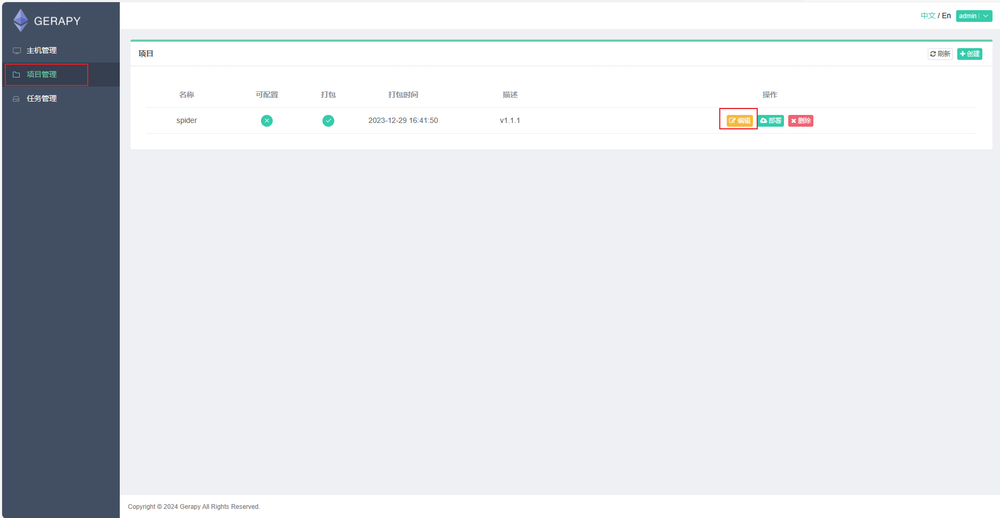

[toc]

# JobFree

> 展示
>
> https://www.fiang.fun

### 开发日志

* 2024.3.19 新增可视化分析大屏


### 一、声明

本程序仅供学习和演示目的，不用于任何商业用途，作者对程序的使用和任何可能的损失概不负责，在使用本程序前，请确保您理解风险，并根据自己的需要进行适当的测试和验证，使用本程序即表示您接受了这个免责声明。

### 二、联系方式

**QQ:** 854771076
**一键三连领取全量数据和原始数据**

**导入数据后的测试账号**

* 前台

http://127.0.0.1:8001

`root/12345678`

* 后台

http://127.0.0.1:8001/admin

`root/12345678`

* 爬虫后台

http://127.0.0.1:5000

`admin/admin`

**未导入后台账号创建**

```sh
cd 项目路径/web-server
python manage.py createsuperuser
```


### 三、支持


### 四、项目架构

#### 4.1 总架构图


#### 4.2 数仓架构


#### 4.3 功能设计


#### 4.4 ER图


### 五、项目部署

### 5.1 docker-compose部署

#### 5.1.1 docker安装

1. **安装 yum-utils**

   ```sh
   sudo yum install -y yum-utils device-mapper-persistent-data lvm
   ```

2. **添加 Docker 的 Yum 源**

   ```sh
   sudo yum-config-manager --add-repo http://mirrors.aliyun.com/docker-ce/linux/centos/docker-ce.repo
   ```

3. **更新 Yum 包的索引**

   ```sh
   sudo yum makecache fast
   ```

4. **安装最新版本的 Docker**

   ```sh
   sudo yum install docker-ce
   ```

5. **启动 Docker**

   ```sh
   sudo systemctl start docker
   sudo systemctl enable docker
   ```

6. **查看版本**

   ```sh
   docker version
   ```

#### 5.1.2 docker-compose安装

1. **yum源安装**

   ```sh
   yum -y install docker-compose
   ```

2. **官网安装**

   ```
   sudo curl -L "https://github.com/docker/compose/releases/download/1.27.4/docker-compose-$(uname -s)-$(uname -m)" -o /usr/local/bin/docker-compose
   sudo chmod +x /usr/local/bin/docker-compose
   ```

3. **查看版本**

   ```sh
   docker-compose --version
   ```

#### 5.1.3 项目部署
```sh 
# docker-compose 创建并启动相应服务
cd 项目目录/
docker-compose up -d
```
#### 5.1.4 进入系统
> 将数据库数据导入数据库后打开连接
> http://虚拟机ip
无数据联系作者

### 5.2 环境初始化

#### 5.2.1 快捷脚本(Windows)

* 下载Anaconda
* 运行env-init.bat
* 注意控制台信息，需要输入两个y

#### 5.2.2 正常流程

* 下载Anaconda

* 创建虚拟环境

  * 爬虫环境

  ```cmd
  conda create -n jobfreeSpider python=3.8
  
  pip install -r .\spiderProject\requirements.txt -i https://pypi.tuna.tsinghua.edu.cn/simple/
  ```

  * Web环境

  ```cmd
  conda create -n jobfree python=3.8
  
  pip install -r .\web-server\requirements.txt -i https://pypi.tuna.tsinghua.edu.cn/simple/
  ```

* 下载MySQL和Redis数据库

### 5.3 项目启动

#### 5.3.1 爬虫程序

##### windows一键启动

> 双击spder-start.bat

##### 正常启动

* 切换至 jobfreeSpider环境

  ```cmd
  conda activate jobfreeSpider
  ```

* 启动scrapyd进程

  ```cmd
  scrapyd
  # 控制台输入
  # windows输入 scrapyd 后收后台挂起，新建cmd执行后续
  # Linux输入nohup scrapyd > scrapyd.log & + ctrl+D挂起
  ```

* 启动Gerapy

  ```cmd
  gerapy runserver 0.0.0.0:5000
  # 控制台输入
  # windows输入 gerapy runserver 0.0.0.0:5000 后收后台挂起
  # Linux输入nohup gerapy runserver 0.0.0.0:5000 > gerapy.log & + ctrl+D挂起
  ```

* 浏览器打开`http://127.0.0.1`进入Gerapy，用户名密码`admin/admin`

* 点击项目管理-编辑

  

* 找到settings.py,修改redis和mysql为自己的配置，不用建表，自动建

  

* 修改完不用保存（自动保存），点击项目管理-部署

  

* 点击重新打包后，再点击部署即可（如果报错99%是你的数据库配置有问题，因为部署时会执行检查代码，连接不上就报错）

  

* 如果部署失败，查看scrapyd进程/日志

##### 

#### 5.3.2 Web程序

##### 配置settings.py

```python
# web-server\DRF\settings.py
# SMTP邮箱设置,怎么申请请自行网上学习
EMAIL_BACKEND = 'django.core.mail.backends.smtp.EmailBackend'
EMAIL_HOST = ''  # 邮箱SMTP服务器地址
EMAIL_HOST_USER = ''  # 邮箱用户名
EMAIL_HOST_PASSWORD = ''  # 邮箱密码
# EMAIL_USE_TLS = True  # 使用TLS加密
DEFAULT_FROM_EMAIL = ''  # 默认发件人邮箱
#redis
REDIS_HOST='127.0.0.1'
REDIS_PORT=6379
REDIS_PSW=''
REDIS_DB=1
#MySQL
DATABASES = {
    'default': {
        'ENGINE': 'django.db.backends.mysql',
        'NAME': 'jobfree',  
        'USER': 'root',  
        'PASSWORD': 'root',  
        'HOST': '127.0.0.1',
        'PORT': 3306,
        'OPTIONS': {'charset': 'utf8mb4'},
    },

}
```

##### 迁移数据库

```cmd
conda activate jobfree
cd web-server
python manage.py migrate
```

##### 导入测试数据

> ETL\test_data.sql，然后完成ETL模块再进行下一步运行

##### windows一键启动

> 双击web-start.bat

##### 正常启动

```cmd
cd web-server
conda activate jobfree
python manage.py runserver
```

#### 5.3.3 ETL模块

##### 环境搭建

> 有集群则跳过

[Windows下使用hadoop+hive+sparkSQL-CSDN博客](https://blog.csdn.net/qq_41631913/article/details/134804263)

##### 初始化hive数据库

> ETL\init.sql

##### 安装python库

```cmd
pip install findspark
```

##### 执行ETL脚本

> ETL\xxx目录下的py文件

##### 模型训练

> model\ALS.py
